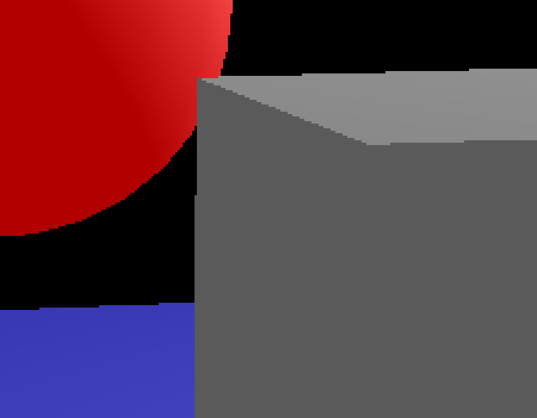
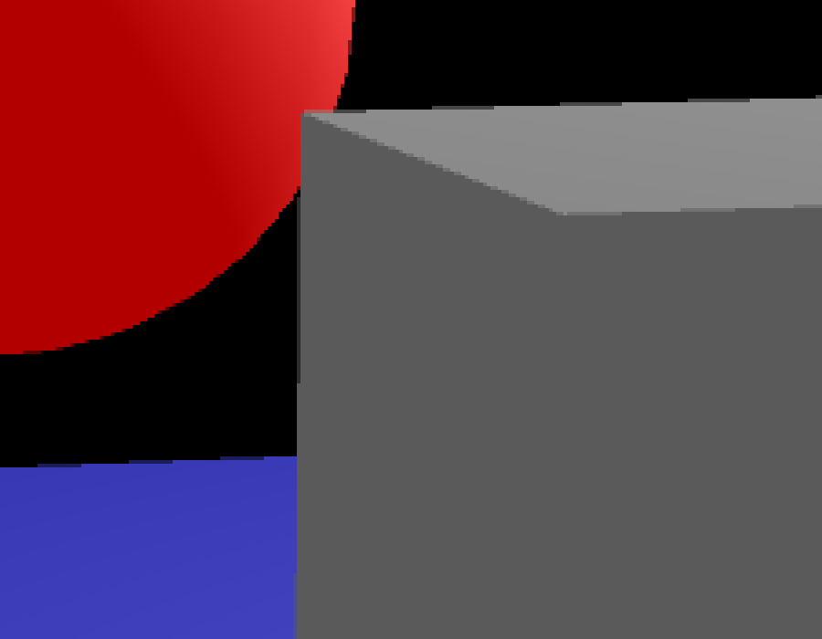

# Qt3D Experiments

Here are few projects that make use of Qt3D framework - I have ended up creating them while working on rendering techniques for QGIS 3D.

Qt3D framework is a really nice addition to Qt ecosystem, but the documentation is still quite sparse and sometimes even wrong. There are not that many code examples floating around that use Qt 3D to demonstrate various 3D rendering techniques, so this is my little contribution towards that.

I have used QML as much as possible to keep the code concise. C++ was only used for bits where QML does not have the necessary bindings (yet?).

## Compiling on Ubuntu

If you are using Ubuntu 18.04 or 20.10, then everything is great and the `qt3d5-dev` package contains all include files you need. But if you are on Ubuntu 18.10, 19.04, 19.10 or 20.04, that package does not contain include files for Qt3DExtras and Qt3DQuickExtras libraries. A workaround is to:

1. download source package for your system version - e.g. from here for 20.04: https://packages.ubuntu.com/source/focal/qt3d-opensource-src and unpack it
2. add to qmake `.pro` file a line to path to those missing includes, e.g. `INCLUDEPATH += /your/path/qt3d-everywhere-src-5.12.8/include`

# Billboards

Demonstrates billboards rendering technique - quads with constant screen size that are always facing the camera. This uses geometry shader to generate quads from points.

# Multisample Anti-aliasing (MSAA)

Shows how to turn on multisample anti-aliasing with Qt3D. We create a render target with multisample textures, render to it (with render state including `MultiSampleAntiAliasing`), and then "resolve" multisample textures with `BlitFramebuffer` framegraph node. Learn more about MSAA in [LearnOpenGL tutorial](https://learnopengl.com/Advanced-OpenGL/Anti-Aliasing).

| Anti-aliasing OFF | Anti-aliasing ON |
|------|-----|
|  |  |

# Screen Space Ambient Occlusion (SSAO)

Implementation of SSAO that is based on [John Chapman's tutorial](http://john-chapman-graphics.blogspot.com/2013/01/ssao-tutorial.html) and [LearnOpenGL tutorial](https://learnopengl.com/Advanced-Lighting/SSAO). It only uses depth buffer as the input and samples from full sphere. The tutorials also use normals (for each pixel) and therefore only use a hemisphere for sampling. But I needed this for rendering where point clouds (with no normal vectors) are used, so I went for this variant (probably lower quality).

# Edge Detection

Edge detection is done as a post-processing pass of scene rendering. In the first stage we generate depth texture and normal vectors texture which are then combined in the post-processing pass using Sobel filter.

# Instanced Rendering

Using instancing to render a single geometry at multiple different positions.

# Lines

Rendering of lines in 3D space with constant screen space thickness. Supports flat and miter joins.

# Arrows

Drawing rotated and scaled textures of arrows on a mesh. (The end goal is that arrow angles/magnitudes of arrows would be read from another texture, not just based on world positions.)

# Relative-to-center Rendering

This code demonstrates the "relative to center" rendering technique with Qt3D.
It is useful when working with large coordinates (e.g. when creating a virtual
globe) without getting numerical issues (which would make objects jump around
when zoomed in). The idea is that we make sure to do model-view-projection (MVP)
matrix calculation in double precision, and only then convert it to single
precision floats that will be used on the GPU.

| Using double precision | Using single precision (without RTC) |
|------|-----|
| <video src="https://github.com/user-attachments/assets/06142879-518e-483f-9c17-d7d05859db13"></video> | <video src="https://github.com/user-attachments/assets/4461deeb-b3fc-437f-8018-610751ae951f"></video> |

# Logarithmic Depth

This code demonstrates logarithmic depth buffer rendering technique.
It is a way to increase the precision of the depth buffer when using
large depth range (e.g. when creating a virtual globe). The idea is
that the fragment shader sets depth of fragments to make a better
use of the range [0..1] instead of keeping the depth value that came
out from the projection matrix.

| Using logarithmic depth | Without logarithmic depth |
|------|-----|
| <video src="https://github.com/user-attachments/assets/8b3441ad-705a-4e8f-adaf-a71d6337fa2f"></video> | <video src="https://github.com/user-attachments/assets/a547b04e-97da-4c3a-98f1-6163480a48ce"></video> |

